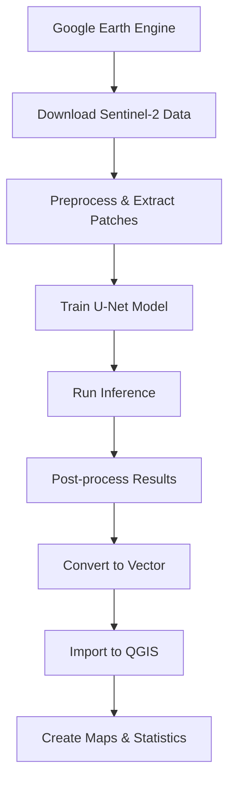

# Deep Learning-Based Object Detection from Satellite Imagery

**Project P7: Indore District Analysis**

A comprehensive system for detecting and mapping objects (buildings, roads, water bodies, vegetation) from high-resolution satellite imagery using Deep Learning and Google Earth Engine.

---

## 📋 Project Overview

- **Study Area**: Indore District, Madhya Pradesh, India
- **Satellite Data**: Sentinel-2 (10m resolution)
- **Deep Learning**: U-Net for semantic segmentation
- **Framework**: TensorFlow/Keras
- **GIS Integration**: QGIS, GeoPandas, Rasterio

---

## 🚀 Quick Start

### 1. Environment Setup

Activate your Python environment and install dependencies:

```bash
# Activate myenv13
conda activate myenv13

# Navigate to project directory
cd "c:\Users\housh\Desktop\GIS and RS\P7_ObjectDetection"

# Install dependencies
pip install -r requirements.txt
```

### 2. Google Earth Engine Workflow

1. **Sign up for GEE**: https://earthengine.google.com/
2. **Open GEE Code Editor**: https://code.earthengine.google.com/
3. **Run scripts in order**:
   - `gee_scripts/01_data_acquisition.js` - Download Sentinel-2 imagery
   - `gee_scripts/02_feature_engineering.js` - Calculate indices (NDVI, NDWI, NDBI)
   - `gee_scripts/03_ml_classification.js` - Random Forest classification
4. **Download data** from Google Drive to `data/raw/`

### 3. Prepare Training Data

```bash
# Extract patches from downloaded imagery
python -m preprocessing.patch_extraction
```

### 4. Train Model

```bash
# Train U-Net model
python -m models.train
```

### 5. Run Inference

```bash
# Run prediction on new imagery
python -m models.inference --model models/saved_models/best_model.h5 --image data/raw/indore_satellite.tif --output data/outputs/
```

### 6. Post-processing

```bash
# Convert to vectors
python -m postprocessing.raster_to_vector --input data/outputs/classification.tif --output data/outputs/vectors/

# Calculate statistics
python -m postprocessing.statistics --raster data/outputs/classification.tif --vectors data/outputs/vectors/ --output data/outputs/reports/
```

---

## 📁 Project Structure

```
P7_ObjectDetection/
├── data/                       # Data directory
│   ├── raw/                   # Raw satellite imagery from GEE
│   ├── aoi/                   # Area of Interest shapefiles
│   ├── training/              # Training patches
│   ├── validation/            # Validation patches
│   └── outputs/               # Model outputs
├── gee_scripts/               # Google Earth Engine JavaScript
│   ├── 01_data_acquisition.js
│   ├── 02_feature_engineering.js
│   └── 03_ml_classification.js
├── preprocessing/             # Data preprocessing
│   ├── image_utils.py        # GeoTIFF I/O, normalization
│   ├── patch_extraction.py   # Create training patches
│   └── data_augmentation.py  # Augmentation pipeline
├── models/                    # Deep Learning models
│   ├── unet.py               # U-Net architecture
│   ├── train.py              # Training script
│   └── inference.py          # Prediction script
├── postprocessing/           # Post-processing & GIS
│   ├── raster_to_vector.py  # Raster to vector conversion
│   ├── spatial_filtering.py # Morphological operations
│   └── statistics.py        # Object statistics
├── config/
│   └── config.yaml          # Configuration
├── requirements.txt         # Python dependencies
└── README.md               # This file
```

---

## 🎯 Object Classes

1. **Background** (ID: 0) - Non-target areas
2. **Buildings** (ID: 1) - Residential and commercial structures
3. **Roads** (ID: 2) - Transportation networks
4. **Water** (ID: 3) - Water bodies
5. **Vegetation** (ID: 4) - Green cover

---

## ⚙️ Configuration

Edit `config/config.yaml` to customize:

- Training parameters (epochs, batch size, learning rate)
- Model architecture (encoder backbone, input channels)
- Data augmentation settings
- Post-processing parameters

---

## 📊 Workflow Summary



---

## 🔬 Model Architecture

**U-Net for Semantic Segmentation**

- **Encoder**: 5 convolutional blocks with max-pooling
- **Bottleneck**: 1024 filters
- **Decoder**: 4 upsampling blocks with skip connections
- **Input**: 256×256×8 (RGB + NIR + NDVI + NDWI + 2 texture bands)
- **Output**: 256×256×5 (5 class probabilities)

**Loss Function**: Categorical Cross-Entropy + Dice Loss  
**Metrics**: IoU, F1-Score, Accuracy  
**Optimizer**: Adam (lr=0.0001)

---

## 📈 Results

After training and inference, you'll get:

1. **Classification Maps** - Raster outputs with class predictions
2. **Vector Layers** - Shapefiles/GeoJSON for each object class
3. **Statistics Reports** - Object counts, areas, density metrics
4. **Visualizations** - Class distribution plots

---

## 🛠️ Troubleshooting

### GDAL Import Error
```bash
# Install GDAL binaries for Windows
# Download from: https://www.gisinternals.com/release.php
pip install GDAL‑3.7.1‑cp310‑cp310‑win_amd64.whl
```

### Out of Memory During Training
- Reduce `batch_size` in `config.yaml`
- Reduce `patch_size` to 128 or 192

### Google Earth Engine Export Timeout
- Reduce the study area extent
- Process in smaller tiles

---

## 📚 References

- **Sentinel-2**: https://scihub.copernicus.eu/
- **Google Earth Engine**: https://earthengine.google.com/
- **U-Net Paper**: https://arxiv.org/abs/1505.04597
- **GADM Boundaries**: https://gadm.org/

---

## 👨‍💻 Usage Examples

See `notebooks/` for interactive examples:
- `01_data_exploration.ipynb` - Explore satellite imagery
- `02_model_training.ipynb` - Train models interactively
- `03_results_analysis.ipynb` - Analyze outputs

---

## 📝 License

This project is for educational purposes as part of GIS and Remote Sensing coursework.

---

## 🤝 Contributing

For questions or improvements, contact your course instructor.

---

**Last Updated**: February 2026  
**Author**: GIS & Remote Sensing Student  
**Course**: Deep Learning Applications in Remote Sensing
